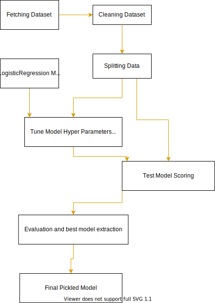

# Optimizing an ML Pipeline in Azure

## Table Of Contents:

| S.No | Section              |
| ---- | -------------------- |
| 1.   | Overview             |
| 2.   | Summary              |
| 3.   | SKLearn Pipeline     |
| 4.   | AutoML               |
| 5.   | Pipeline Comparision |
| 6.   | Future Work          |

## Overview

This project is part of the Udacity Azure ML Nanodegree.
In this project, we build and optimize an Azure ML pipeline using the Python SDK and a provided Scikit-learn model.
This model is then compared to an Azure AutoML run.

## Data Analysis

### Bank Marketing

#### Abstract:

The data is related with direct marketing campaigns (phone calls) of a Portuguese banking institution. The classification goal is to predict if the client will subscribe a term deposit (variable y).

#### Data Set Information:

The data is related with direct marketing campaigns of a Portuguese banking institution. The marketing campaigns were based on phone calls. Often, more than one contact to the same client was required, in order to access if the product (bank term deposit) would be ('yes') or not ('no') subscribed.

### Attribute Information:

#### Bank client data:

##### Age (numeric)

#### Job :

type of job (categorical: 'admin.', 'blue-collar', 'entrepreneur', 'housemaid', 'management', 'retired', 'self-employed', 'services', 'student', 'technician', 'unemployed', 'unknown')

#### Marital :

marital status (categorical: 'divorced', 'married', 'single', 'unknown' ; note: 'divorced' means divorced or widowed)
Education (categorical: 'basic.4y', 'basic.6y', 'basic.9y', 'high.school', 'illiterate', 'professional.course', 'university.degree', 'unknown')

#### Default:

has credit in default? (categorical: 'no', 'yes', 'unknown')

#### Housing:

has housing loan? (categorical: 'no', 'yes', 'unknown')

#### Loan:

has personal loan? (categorical: 'no', 'yes', 'unknown')

#### Related with the last contact of the current campaign:

#### Contact:

contact communication type (categorical: 'cellular','telephone')

#### Month:

last contact month of year (categorical: 'jan', 'feb', 'mar', ..., 'nov', 'dec')

#### Day_of_week:

last contact day of the week (categorical: 'mon','tue','wed','thu','fri')

#### Duration:

last contact duration, in seconds (numeric). Important note: this attribute highly affects the output target (e.g., if duration=0 then y='no'). Yet, the duration is not known before a call is performed. Also, after the end of the call y is obviously known. Thus, this input should only be included for benchmark purposes and should be discarded if the intention is to have a realistic predictive model.

### Other attributes:

#### Campaign:

number of contacts performed during this campaign and for this client (numeric, includes last contact)

#### Pdays:

number of days that passed by after the client was last contacted from a previous campaign (numeric; 999 means client was not previously contacted)

#### Previous:

number of contacts performed before this campaign and for this client (numeric)

#### Poutcome:

outcome of the previous marketing campaign (categorical: 'failure','nonexistent','success')

### Social and economic context attributes

#### Emp.var.rate:

employment variation rate - quarterly indicator (numeric)

#### Cons.price.idx:

consumer price index - monthly indicator (numeric)

#### Cons.conf.idx:

consumer confidence index - monthly indicator (numeric)

#### Euribor3m:

euribor 3 month rate - daily indicator (numeric)

#### Nr.employed:

number of employees - quarterly indicator (numeric)

### Output variable (desired target):

**y - has the client subscribed a term deposit? (binary: 'yes', 'no')**

## Summary

The classification goal is to predict if the client will subscribe a term deposit (variable y)
 
After trying Hyperparameter optimization using on Logistic Regression using HyperDrive gave an accuracy of 90.1%
While when the dataset was fed to an AutoML run it predicted a model which used LightGBMClassifier<b>(major)</b> and various other classifiers to create a VotingEnsemble which gave a prediction accuracy of 91.6%

## Scikit-learn Pipeline

The pipeline Architecture consisted of following steps:

1. Fetching dataset from the remote file server
2. Cleaning the dataset and converting non digit datapoints to digit based using encoders
3. Splitting the data into train and test
4. Selecting model in our case it was Logistic Regression
5. Selecting Parameter Sampler which has two parameters --C and --Max_iter which are chosen randomly from the given field values (RandomParameterSampler)
6. Selecting Early stoping policy in out case it was BanditPolicy
7. Finally plugging all the configs, parameterSampler, early stopping policy into hyperDrive to get the model trained on various hyperParameters
8. Extracting the best run and hyperParameters and saving it into a pickle to use it later

### What are the benefits of the parameter sampler you chose?

The Sampler which we chose was RandomSampler and it had a some or the other benefits over other samplers.
The most important factor of chosing a randomSampler was to give the pipeline to give a wild shot which can somehow give the best hyper-parameters
which other samplers might have missed or took more time to find it

### What are the benifits of early stopping policy you chose?

We chose Bandit Policy for Early Stopping to keep the regularization.
it is based on slack factor/slack amount and evaluation interval. Bandit terminates runs where the primary metric is not within the specified slack factor/slack amount compared to the best performing run which helped our training time to cut half by estimating the later behavior.

In our case, the early termination policy is applied at every interval when metrics are reported, starting at evaluation interval 5. Any run whose best metric is less than (1/(1+0.1) or 91% of the best performing run will be terminated.

For a conservative policy that provides savings without terminating promising jobs, consider a Median Stopping Policy with evaluation_interval 1 and delay_evaluation 5. These are conservative settings, that can provide approximately 25%-35% savings with no loss on primary metric (based on our evaluation data).
For more aggressive savings, use Bandit Policy with a smaller allowable slack or Truncation Selection Policy with a larger truncation percentage.

## AutoML

The AutoML run as a best model gave a VotingEnsemble model while to get a real model the second best model or most contributing model was
LightGBMClassifier whose parameters were
boosting_type:gbdt,class_weight=None,learning_rate=0.1,min_child_weight=0.001,min_split_gain=0.0,subsample=1.0 and subsample_for_bin=200000

## Pipeline comparison

### Compare the two models and their performance. What are the differences in accuracy? In architecture?If there was a difference, why do you think there was one?

The performance of both models were more or less similar the hyperDrive optimized the hyper-parameters in a LogisticRegression model to get an accuracy as primary
metic of 0.906 while the AutoML gave a votingEnsemble which gave model an accuracy of 0.917 while the most contributing model was LightGBMClassifier.
The architectural difference in models were while LogisticRegression was more focused on fitting the data on a sigmoid scale LightGBMClassifier is a gradient boosting framework that uses tree based learning algorithms

## Future work

What are some areas of improvement for future experiments? Why might these improvements help the model?  
The Accuracy will remain more or less same until a better analysis of bank data is done and drawn into more data with additional datapoints which may help getting a better
prediction
